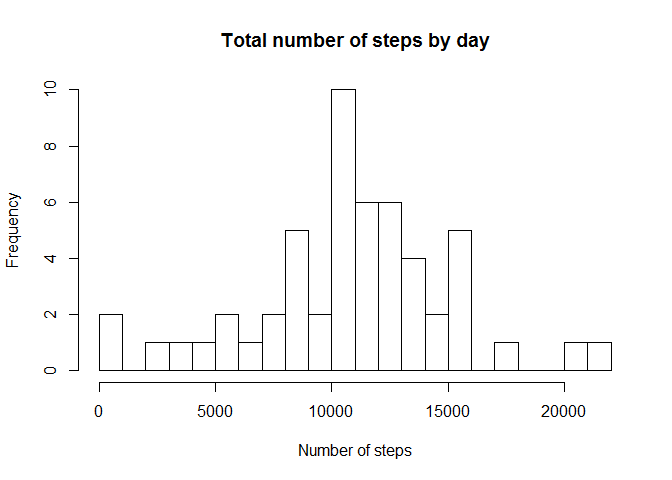
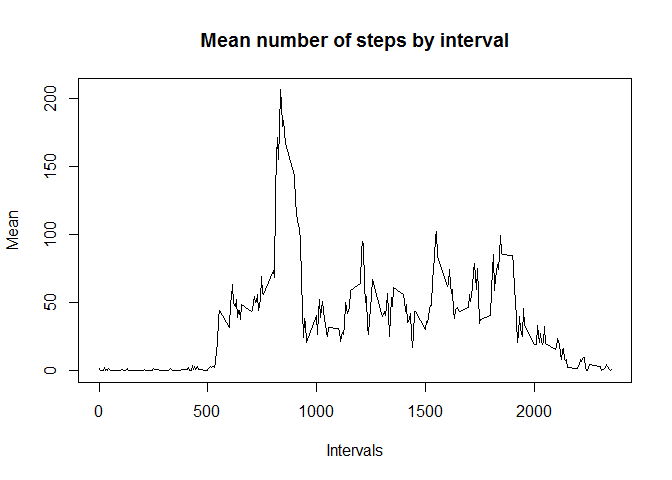
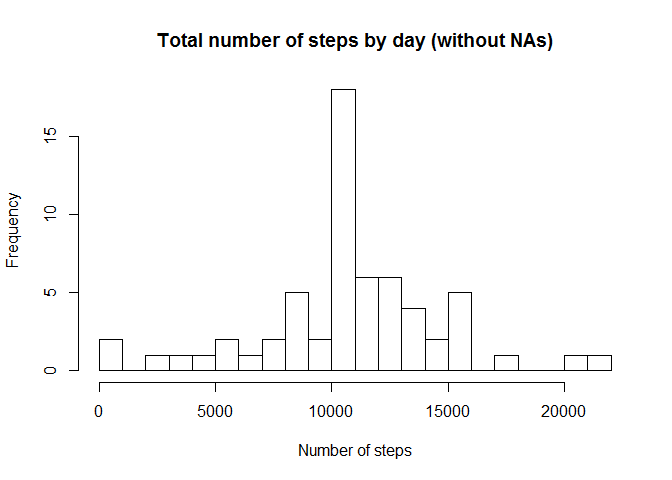
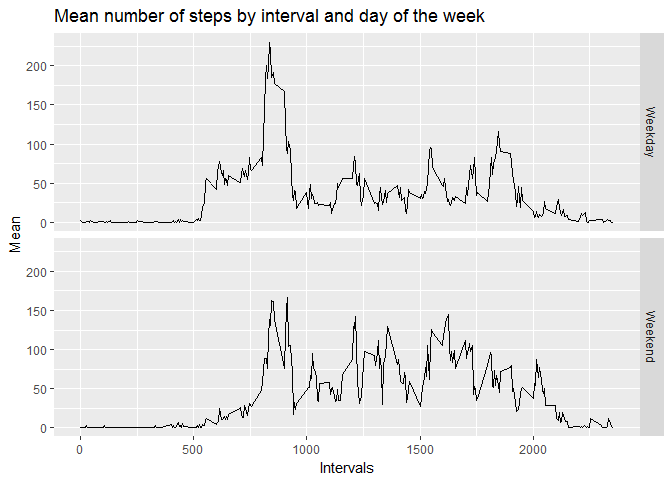
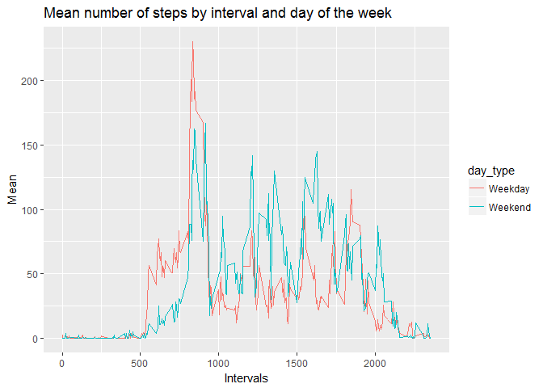

# Analysis of personal activity data
Ewerton Monti  
25/11/2016  


# Loading and preprocessing the data
After downloading the data, load it into R.

```r
activity_data <- read.csv("./data/activity.csv", 
                         header = TRUE, na.strings = "NA", sep = ",",
                         stringsAsFactors = FALSE, 
                         colClasses = c(date = "Date"))
```

# What is mean total number of steps taken per day?
Firts it is calculated the total number of steps taken per day. The structure of the data created is exhibited.

```r
steps_by_day <- aggregate(steps ~ date , activity_data, sum)
str(steps_by_day)
```

```
## 'data.frame':	53 obs. of  2 variables:
##  $ date : Date, format: "2012-10-02" "2012-10-03" ...
##  $ steps: int  126 11352 12116 13294 15420 11015 12811 9900 10304 17382 ...
```

Then a histogram of the total number of steps taken each day is created.

```r
hist(steps_by_day$steps, breaks = 20, main = "Total number of steps by day", 
     xlab = "Number of steps")
```

<!-- -->

Finally, the mean and median of the total number of steps taken per day are calculated and reported.

```r
mean_steps_day <- mean(steps_by_day$steps, na.rm = TRUE)
median_steps_day <- median(steps_by_day$steps, na.rm = TRUE)
paste("The mean number of steps taken each day is ", round(mean_steps_day, 2))
```

```
## [1] "The mean number of steps taken each day is  10766.19"
```

```r
paste("The median number of steps taken each day is ", round(median_steps_day, 2))
```

```
## [1] "The median number of steps taken each day is  10765"
```

# What is the average daily activity pattern?
The first step is to calculate the mean number of steps taken by interval. The structure of the data created is shown.

```r
steps_by_interval <- aggregate(steps ~ interval, activity_data, mean)
str(steps_by_interval)
```

```
## 'data.frame':	288 obs. of  2 variables:
##  $ interval: int  0 5 10 15 20 25 30 35 40 45 ...
##  $ steps   : num  1.717 0.3396 0.1321 0.1509 0.0755 ...
```
Then a time series plot is created showing the average number of steps taken by each of the 5-minute intervals.

```r
plot(steps_by_interval$interval, steps_by_interval$steps, type = "l", 
     main = "Mean number of steps by interval", xlab = "Intervals", ylab = "Mean")
```

<!-- -->

The 5-minute interval that, on average, contains the maximum number of steps is shown below.

```r
steps_by_interval[which.max(steps_by_interval$steps), 1]
```

```
## [1] 835
```
And its average is:

```r
steps_by_interval[which.max(steps_by_interval$steps), 2]
```

```
## [1] 206.1698
```

# Imputing missing values
Below is the total number of missing values in the dataset.

```r
sum(is.na(activity_data$steps))
```

```
## [1] 2304
```

In order to fill in all of the missing values, it was decided to adopt the strategy of using the mean number of steps for that 5-minute interval.

The first step was to merge the original data with the dataset that has the mean number of steps by interval, called "steps_by_interval", created above. The result was a new dataset adding a column with the mean number of steps for each interval.

```r
activity_data_tmp <- merge(activity_data, steps_by_interval, by = 'interval', suffixes = c("_orig", "_mean"))
head(activity_data_tmp)
```

```
##   interval steps_orig       date steps_mean
## 1        0         NA 2012-10-01   1.716981
## 2        0          0 2012-11-23   1.716981
## 3        0          0 2012-10-28   1.716981
## 4        0          0 2012-11-06   1.716981
## 5        0          0 2012-11-24   1.716981
## 6        0          0 2012-11-15   1.716981
```

Then all NA values are replaced with the mean of the specific interval. We can see the change in the first line of the dataset.

```r
nas <- is.na(activity_data_tmp$steps_orig)
activity_data_tmp[nas,"steps_orig"] <- activity_data_tmp[nas,"steps_mean"]
head(activity_data_tmp)
```

```
##   interval steps_orig       date steps_mean
## 1        0   1.716981 2012-10-01   1.716981
## 2        0   0.000000 2012-11-23   1.716981
## 3        0   0.000000 2012-10-28   1.716981
## 4        0   0.000000 2012-11-06   1.716981
## 5        0   0.000000 2012-11-24   1.716981
## 6        0   0.000000 2012-11-15   1.716981
```

A new dataset is created. It is equal to the original dataset but with the missing data filled in.

```r
activity_data_noNA <- activity_data_tmp[,c(1:3)]
colnames(activity_data_noNA) <- c("interval", "steps", "date")
head(activity_data_noNA)
```

```
##   interval    steps       date
## 1        0 1.716981 2012-10-01
## 2        0 0.000000 2012-11-23
## 3        0 0.000000 2012-10-28
## 4        0 0.000000 2012-11-06
## 5        0 0.000000 2012-11-24
## 6        0 0.000000 2012-11-15
```

There is no NA remaining.

```r
sum(is.na(activity_data_noNA$steps))
```

```
## [1] 0
```

The next goal is to make a histogram of the total number of steps taken each day. The first step is to create a dataset with this data.

```r
steps_by_day_noNA <- aggregate(steps ~ date, activity_data_noNA, sum)
head(steps_by_day_noNA)
```

```
##         date    steps
## 1 2012-10-01 10766.19
## 2 2012-10-02   126.00
## 3 2012-10-03 11352.00
## 4 2012-10-04 12116.00
## 5 2012-10-05 13294.00
## 6 2012-10-06 15420.00
```
Then the histogram is made.

```r
hist(steps_by_day_noNA$steps, breaks = 20, 
     main = "Total number of steps by day (without NAs)", xlab = "Number of steps")
```

<!-- -->

The new mean and median number of steps taken each day are calculated and reported. They differ from the first dataset. Imputing missing data in this dataset with the strategy described earlier has made the mean and median number of daily steps being equal.  

```r
mean_steps_day_noNA <- mean(steps_by_day_noNA$steps, na.rm = TRUE)
median_steps_day_noNA <- median(steps_by_day_noNA$steps, na.rm = TRUE)
paste("The new mean number of steps taken each day is ", round(mean_steps_day_noNA, 2))
```

```
## [1] "The new mean number of steps taken each day is  10766.19"
```

```r
paste("The new median number of steps taken each day is ", round(median_steps_day_noNA, 2))
```

```
## [1] "The new median number of steps taken each day is  10766.19"
```

# Are there differences in activity patterns between weekdays and weekends?
In order to find if there are any differences in activity patterns between weekdays and weekends, it is created a variable with the day of the week and then a variable separating weekdays from weekends.  
Note: in the code below you can see the words "sábado" and "domingo", meaning "Saturday" and "Sunday" in portuguese. I am sorry for it. I changed the language of my R environment, but I was not able the make knitr understand it.

```r
activity_data_noNA$weekday <- as.factor(weekdays.Date(activity_data_noNA$date))

activity_data_noNA$day_type <- 
    ifelse(activity_data_noNA$weekday == "sábado" | 
               activity_data_noNA$weekday == "domingo","Weekend","Weekday")
```

With this variable ready, a new dataset is created with the average number of steps by day type (weekends or weekdays) and interval. 

```r
steps_by_int_wday <- aggregate(steps ~ day_type + interval, activity_data_noNA, mean)
head(steps_by_int_wday)
```

```
##   day_type interval      steps
## 1  Weekday        0 2.25115304
## 2  Weekend        0 0.21462264
## 3  Weekday        5 0.44528302
## 4  Weekend        5 0.04245283
## 5  Weekday       10 0.17316562
## 6  Weekend       10 0.01650943
```

Finally, ggplot2 is loaded and a panel plot comparing the average number of steps taken per 5-minute interval across weekdays and weekends is created.

```r
library(ggplot2)
```

```
## Warning: package 'ggplot2' was built under R version 3.3.2
```

```r
qplot(interval, steps, data = steps_by_int_wday, facets = day_type ~., 
      geom = "line", main = "Mean number of steps by interval and day of the week",
      xlab = "Intervals", ylab = "Mean")
```

<!-- -->

I think that would be easier to see the differences between weekends and weekdays using different line colors instead of panels, so a new plot is added.

```r
qplot(interval, steps, data = steps_by_int_wday, color = day_type, 
      geom = "line", main = "Mean number of steps by interval and day of the week",
      xlab = "Intervals", ylab = "Mean")
```

<!-- -->

It is possible to see that the peak of steps by interval happens on weekdays in early morning (as shown earlier), but for the remaining hours of the day there is more activity by weekends.
